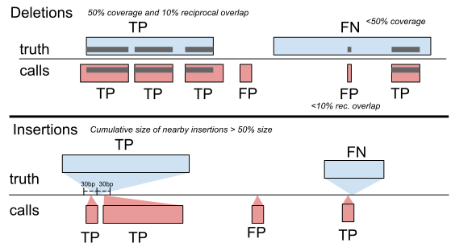
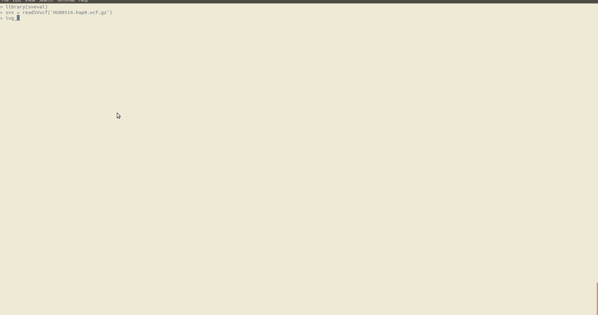

# sveval

[](https://travis-ci.com/jmonlong/sveval)
[](https://codecov.io/gh/jmonlong/sveval)

Functions to compare a SV call sets against a truth set.

## Installation

Install using Bioconductor installer:

```r
BiocManager::install('jmonlong/sveval')
```

Or the "old way":

```r
source('http://bioconductor.org/biocLite.R')
biocLite('jmonlong/sveval')
```

You might need to install *devtools* and *BiocManager* first:

```r
install.packages(c('devtools', 'BiocManager'))
```

---

To install locally (e.g. in a HPC without root permission), one solution is to specify the path of a library folder in your home.

```r
.libPaths('~/R/library/')
## Install as above
```

## Usage

```r
library(sveval)
eval.o = svevalOl('calls.vcf', 'truth.vcf')
eval.o$eval # data.frame with results using all variants
plot_prcurve(eval.o$curve)
eval.o$INS$fp # a GRanges object with false-positives insertions
```

Outputs a list with a data.frame with TP, FP, TN, precision, recall and F1 for all variants and for each SV type, and a another data.frame with the results using increasing quality thresholds to make a precision-recall curve.

Some of the most important other parameters:

- `max.ins.dist=` maximum distance for insertions to be clustered. Default is 20.
- `min.cov=` the minimum coverage to be considered a match. Default is 0.5
- `min.del.rol=` minimum reciprocal overlap for deletions. Default is 0.1
- `min.size=` the minimum SV size to be considered. Default 0.
- `bed.regions=` If non-NULL, a GRanges object or path to a BED file (no headers) with regions of interest.
- `outfile=` the TSV file to output the results. If NULL (default), returns a data.frame.
- `ins.seq.comp=TRUE` compare sequence instead of insertion sizes. Default is *FALSE*.
- `check.inv` should the sequence of MNV be compared to identify inversions. Default is *FALSE*.
- `geno.eval`/`merge.hets`/`stitch.hets` options for genotype evaluation, see below.

See full list of parameters in the [manual](docs/sveval-manual.pdf) or by typing `?svevalOl` in R.

### Precision-recall curve comparing multiple methods

```r
eval.1 = svevalOl('calls1.vcf', 'truth.vcf')
eval.2 = svevalOl('calls2.vcf', 'truth.vcf')
plot_prcurve(list(eval.1$curve, eval.2$curve), labels=c('method1', 'method2'))
```

Or if the results were written in files:

```r
plot_prcurve(c('methods1-prcurve.tsv', 'methods2-prcurve.tsv'), labels=c('method1', 'method2'))
```

### Evaluation per size or per region

The evaluation can already be narrowed down to a size range and a set of regions (`min.size=`/`max.size=`/`bed.regions=` in `svevalOl`).
It's also interesting to split the result into (many) different SV classes without having to rerun `svevalOl`.
Two functions are provided to take the output of `svevalOl` and compute the evaluation metrics per size class or per region: `plot_persize` and `plot_perregion`.
Of note, there is no exploration of the calls' quality like for PR curves. 
The new metrics are computed from the set of TP/FP/FN as defined by the "best" run (maximum F1 score).

```r
eval.o = svevalOl('calls.vcf', 'truth.vcf')
plot_persize(eval.o)
regs = GRanges(...)
plot_perregion(eval.o, regs)
```

Both functions return a list of ggplot2 graphs.
If using `plot=FALSE` they will return a data.frame.

### Genotype evaluation

By default sveval doesn't take the genotype into account, more a calling evaluation than a genotype evaluation.
To compare genotype, the evaluation can be performed separately for heterozygous and homozygous variants.
Before doing that it sometimes help to merge very similar hets into homs.
To a lower extent, it also helps to stitch fragmented hets before trying to merge them into homs.
The relevant parameters in `svevalOl` are:

- `geno.eval=TRUE` compare hets/homs separately.
- `stitch.hets=TRUE` stitch fragmented hets.
- `stitch.dist` the maximum distance between two hets to be stitched. Default 20 bp.
- `merge.hets=TRUE` merge hets into hom before comparison.
- `merge.rol` the minimum reciprocal overlap between two hets to be merged. Default is 0.8.

Hence, the **recommended command for genotype evaluation**:

```r
eval.o = svevalOl('calls.vcf', 'truth.vcf', geno.eval=TRUE, stitch.hets=TRUE, merge.hets=TRUE)
```

### Frequency annotation

Assuming that we have a SV catalog with a field with frequency estimates, we can overlap called SVs and annotate them with the maximum frequency of overlapping SVs in the catalog.

For example:

```r
freqAnnotate('calls.vcf', 'gnomad.vcf', out.vcf='calls.withFreq.vcf')
```

## Methods

- For deletions, at least 50% coverage and at least 10% reciprocal overlap.
- For insertions, size of nearby insertions (+- 20 bp) at least as much as 50% the size of insertion. Or comparing inserted sequence (sequence similarity instead of size).
- For inversions, same as deletions. If using REF/ALT sequences (i.e. not symbolic ALT), inversions are variants longer than 10 bp where the reverse complement of ALT matches REF at least 80%.



## Docker

A docker image of R with this package installed is available [here](https://hub.docker.com/r/jmonlong/sveval/).

## Interactive exploration of SVs in a variation graph

Using the `ivg_sv` function and a *xg* graph ([vg](https://github.com/vgteam/vg) must be installed):


