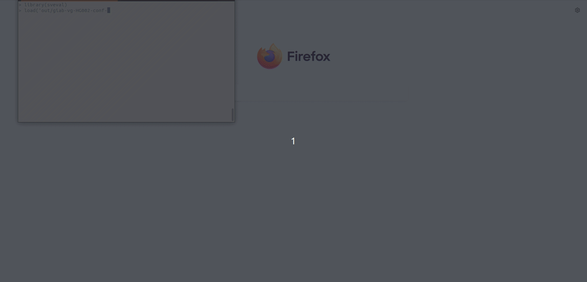

# sveval

[](https://travis-ci.com/jmonlong/sveval)
[](https://codecov.io/gh/jmonlong/sveval)
[](https://github.com/jmonlong/sveval/releases/latest)
[](https://quay.io/repository/jmonlong/sveval)

Functions to compare a SV call sets against a truth set.
This package uses mostly overlap-based metrics, although for insertions it can align the inserted sequences to match variants.
It uses:

- coverage-based metrics to evaluate SV *calling* (absence/presence) without being affected by fragmented calls.
- bipartite clustering to evaluate SV *genotyping*, combined with some tricks to minimize the effect of fragmented calls.

1. [Installation](#installation)
1. [Usage](#usage)
    1. [Quickstart](#quickstart)
    1. [Genotype evaluation](#genotype-evaluation)
    1. [Wiggle room in simple repeats](#wiggle-room-in-simple-repeats)
    1. [Evaluation per size or per region](#evaluation-per-size-or-per-region)
    1. [Precision-recall curve comparing multiple methods](#precision-recall-curve-comparing-multiple-methods)
    1. [Frequency annotation](#frequency-annotation)
    1. [Snakemake pipeline](#snakemake-pipeline)
1. [Methods](#methods)
1. [Docker](#docker)
1. [Interactive exploration of the results](#interactive-exploration-of-the-results)
    1. [Interactive exploration of FPs/FNs/TPs](#interactive-exploration-of-fpsfnstps)
    1. [Interactive exploration of SVs in a variation graph](#interactive-exploration-of-svs-in-a-variation-graph)
1. [Reading a VCF with SVs](#reading-a-vcf-with-svs)
1. [BND and translocations](#bnd-and-translocations)


## Installation

Install using the Bioconductor installer:

```r
BiocManager::install('jmonlong/sveval')
```

You might need to install *devtools*, *remotes* and *BiocManager* first:

```r
install.packages(c('devtools', 'remotes', 'BiocManager'))
```

## Usage

### Quickstart

A "command line" option is to run the wrapper function used by the [Snakemake pipeline section](#snakemake-pipeline). For example:

```sh
Rscript -e  "sveval::wrapper('sveval')" -calls calls.vcf.gz -truth truth.vcf.gz -sample SAMPNAME -region conf.bed -simprep simpleRepeat.bed.gz -output sveval_out
```

More information in the [wrapper command-line section](#Wrapper-command-line).

Otherwise, run interactively in R (or in a script):

```r
library(sveval)
eval.o = svevalOl('calls.vcf', 'truth.vcf')
eval.o$eval # data.frame with results using all variants
plot_prcurve(eval.o$curve)
eval.o$INS$fp # a GRanges object with false-positives insertions
```

Outputs a list with a data.frame with TP, FP, TN, precision, recall and F1 for all variants and for each SV type, and a another data.frame with the results using increasing quality thresholds to make a precision-recall curve.

Some of the most important other parameters:

- `max.ins.dist=` maximum distance for insertions to be clustered. Default is 20.
- `min.cov=` the minimum coverage to be considered a match. Default is 0.5
- `min.del.rol=` minimum reciprocal overlap for deletions. Default is 0.1
- `min.size=` the minimum SV size to be considered. Default 0.
- `bed.regions=` If non-NULL, a GRanges object or path to a BED file (no headers) with regions of interest.
- `outfile=` the TSV file to output the results. If NULL (default), returns a data.frame.
- `ins.seq.comp=TRUE` compare sequence instead of insertion sizes. Default is *FALSE*.
- `check.inv` should the sequence of MNV be compared to identify inversions. Default is *FALSE*.
- `geno.eval`/`merge.hets`/`stitch.hets` options for genotype evaluation, see below.

See full list of parameters in the [manual](docs/sveval-manual.pdf) or by typing `?svevalOl` in R.

### Genotype evaluation

By default sveval doesn't take the genotype into account, it's more a "calling" evaluation than a "genotyping" evaluation.
To compare genotype, the evaluation can be performed separately for heterozygous and homozygous variants.
Before doing that it sometimes helps to merge very similar hets into homs.
To a lower extent, it also helps to stitch fragmented hets before trying to merge them into homs.
When comparing genotypes we'd rather match variants 1-to-1 instead of using the cumulative coverage metrics.
It's not about testing if a SV was called in the region but to make sure the actual genotype in the region is correct.
This penalizes "over-genotyping": genotyping the near-duplicate variants multiple times.
The relevant parameters in `svevalOl` are:

- `geno.eval=TRUE` compare hets/homs separately.
- `method="bipartite"` matches variants 1-to-1 instead of the cumulative coverage metrics. 
- `stitch.hets=TRUE` stitch fragmented hets.
- `stitch.dist` the maximum distance between two hets to be stitched. Default 20 bp.
- `merge.hets=TRUE` merge hets into hom before comparison.
- `merge.rol` the minimum reciprocal overlap between two hets to be merged. Default is 0.8.

Hence, the **recommendeded command for genotype evaluation**:

```r
eval.o = svevalOl('calls.vcf', 'truth.vcf', geno.eval=TRUE, method="bipartite", stitch.hets=TRUE, merge.hets=TRUE)
```

### Wiggle room in simple repeats

To help match SVs within simple repeats, we can provide information about annotated simple repeats in the genome.
sveval will allow more wiggle room, i.e. for a SV to "move" along a simple repeat segment.
It helps matching similar simple repeat variants that are just positioned differently.
For example, a similar deletion might be called at the beginning of the annotated repeat but positioned at the end in the truthset.
And because simple repeats are not perfect and the SVs exactly the same, left-aligning might not handle these cases.

A GRanges object can be provided to `svevalOl` with `simprep=`.

We've prepared BED files for GRCh38 and GRCh37, see [docs](docs) for more details.

### Evaluation per size or per region

The evaluation can already be narrowed down to a size range and a set of regions (`min.size=`/`max.size=`/`bed.regions=` in `svevalOl`).
It's also interesting to split the result into (many) different SV classes without having to rerun `svevalOl`.
Two functions are provided to take the output of `svevalOl` and compute the evaluation metrics per size class or per region: `plot_persize` and `plot_perregion`.
Of note, there is no exploration of the calls' quality like for PR curves. 
The new metrics are computed from the set of TP/FP/FN as defined by the "best" run (maximum F1 score).

```r
eval.o = svevalOl('calls.vcf', 'truth.vcf')
plot_persize(eval.o)
regs = GRanges(...)
plot_perregion(eval.o, regs)
```

Both functions return a list of ggplot2 graphs.
If using `plot=FALSE` they will return a data.frame.

### Precision-recall curve comparing multiple methods

```r
eval.1 = svevalOl('calls1.vcf', 'truth.vcf')
eval.2 = svevalOl('calls2.vcf', 'truth.vcf')
plot_prcurve(list(eval.1$curve, eval.2$curve), labels=c('method1', 'method2'))
```

Or if the results were written in files:

```r
plot_prcurve(c('methods1-prcurve.tsv', 'methods2-prcurve.tsv'), labels=c('method1', 'method2'))
```

### Frequency annotation

Assuming that we have a SV catalog with a field with frequency estimates, we can overlap called SVs and annotate them with the maximum frequency of overlapping SVs in the catalog.

For example:

```r
freqAnnotate('calls.vcf', 'gnomad.vcf', out.vcf='calls.withFreq.vcf')
```

### Wrapper command-line

To use sveval as a command line and avoid interactive usage of R, see the wrapper function used by the Snakemake pipeline documented below.
Briefly, to compare a call set to a truthset, run something like:

```sh
Rscript -e  "sveval::wrapper('sveval')" -calls calls.vcf.gz -truth truth.vcf.gz -sample SAMPNAME -region conf.bed -simprep simpleRepeat.bed.gz -output sveval_out
```

This command will output three files:

1. A `sveval_out-prcurve.tsv` TSV file with the evaluation metrics for each quality threshold. Useful to plot a precision-recall curve. The first rows (*qual=0*) correspond to using no quality threshold, i.e. the metrics when using all SV calls.
1. A `sveval_out-persize.tsv` TSV file with the evaluation metrics for SVs grouped into a few size classes.
1. A `sveval_out-sveval.RData` file with the results as a R object that can be loaded in R, for example to make graphs or [explore the results interactively](#interactive-exploration-of-svs-in-a-variation-graph).

The arguments are detailed by running `Rscript -e  "sveval::wrapper('sveval')"`:

```sh
Evaluate SV calls against a truthset
	-c, -calls	input VCF with the SV calls
	-t, -truth	input VCF with the truth SVs
	-s, -sample	sample name
	-o, -output	output prefix for Rdata and TSV files
	-e, -eval	Optional. evaluation type: 'call' for absence/presence, 'geno' if genotypes have to match. Default: call
	-r, -region	Optional. regions of interest. NA means whole genome. Default: NA
	-p, -simprep	Optional. simple repeat track. NA means disabled. Default: NA
	-i, -inversion	Optional. look for inversions? Default: FALSE
	-m, -minol	Optional. minimum overlap to match variants. Default:0.5
```

Of note the Snakemake pipeline also uses the `mergetsvs` subcommand to merge evaluations from different runs (e.g. tools, call/genotype, regions). 
Run `Rscript -e  "sveval::wrapper(mergetsvs)"` for more information.

### Snakemake pipeline

In practice, VCF should be normalized beforehand (e.g. using bcftools), and we might want to evaluate multiple methods, across different regions set (e.g. whole-genome, confident regions, non-repeat regions), and for both calling and genotyping performance. 
To streamline this process, we use a [Snakemake](https://snakemake.readthedocs.io/en/stable/index.html) pipeline.
This pipeline will perform the normalization, run all the evaluation, and summarize the results in TSV files and graphs.
We show an example on how to evaluate calls against the GIAB SV truthset.

See the [`snakemake` folder](snakemake).

## Methods

### SV presence

To evaluate the *calling* performance, i.e. that the presence of a SV is correctly predicted no matter the exact genotype, we use a coverage-based approach.
In brief we ask how much of a variant is "covered" by variants in the other set. 
In contrast to a simple reciprocal overlap, this approach is robust to call fragmentation.

The default criteria implemented are:

- For deletions, at least 50% coverage by other deletions with at least 10% reciprocal overlap.
- For insertions, size of nearby insertions (+- 20 bp) at least as much as 50% the size of insertion. Or comparing inserted sequence (sequence similarity instead of size).
- For inversions, same as deletions. If using REF/ALT sequences (i.e. not symbolic ALT), inversions are variants longer than 10 bp where the reverse complement of ALT matches REF at least 80%.


### SV genotype

When evaluating exact genotypes, heterozygous and homozygous variants are overlapped separately (with the same criteria as described above).
For each genotype, the overlap relationship is then used to build a bipartite graph. 
Each *call* variant is matched with a *truth* variant using bipartite clustering. 
All variants matched are considered true positives, and the rest errors.

To reduce the effect of fragmented calls, we can stitch variants that are extremely close into one longer variant.
Similarly, if two heterozygous variants are extremely similar, they can be merged into one homozygous variant.

## Docker

A docker image of R with this package installed is available at [quay.io/jmonlong/sveval](https://quay.io/repository/jmonlong/sveval) (e.g. `quay.io/jmonlong/sveval:v2.3.0`). 
More information about starting the container and using sveval or the snakemake pipeline at [snakemake/README.md#start-the-docker-container](snakemake/README.md#start-the-docker-container).

## Interactive exploration of the results

### Interactive exploration of FPs/FNs/TPs

Using the `explore_eval_svs` function, an app starts in the web browser. 
False positives (FPs), false negatives (FNs), or true positives (TPs), can be quickly displayed together with the other SVs nearby.
This is useful to double-check that SVs were matched properly and that FPs/FNs are really FPs/FNs.
There is also a link to open the current region on the UCSC Genome Browser to help get a feel for the genomic regions, esp. its repeat content.



### Interactive exploration of SVs in a variation graph

Using the `ivg_sv` function and a *xg* graph ([vg](https://github.com/vgteam/vg) must be installed):


The new version includes a linear representation of the variants in the region: 


## Reading a VCF with SVs

Reading a VCF in R can consume a lot of memory if it contains millions of variants, large variants with explicit sequence information, and in general rich INFO fields. 
Only a subset of this information is used by *sveval* in the end: all the SNV/indels are filtered, just the few typical SV INFO fields are used, and sometimes we don't want (or can't) use sequence information.
To speed up the reading of large VCF, a C parser was implemented to only keep SVs and the relevant information. 

The `readSVvcf` function is a wrapper to this parser and can return either a data.frame, a GRanges, or a VCF object as define by the [VariantAnnotation package from Bioconductor](https://bioconductor.org/packages/release/bioc/html/VariantAnnotation.html).

The main parameters specify what information to keep and which variants to filter out right away:

- `keep.ref.seq`/`keep.ins.seq`: should we keep the full explicit sequence of the *REF*/*ALT* alleles? Default is *FALSE*.
- `other.fields`: which other (INFO) field(s) should be saved?
- `min.sv.size`: what is the minimum size required to keep a variant? Default is *10* (bp)

### BND and translocations

There are different ways of representing translocations (or "junctions") in VCF. 
The VCF parser here will recognize BND if the other genomic location is specified with either:

- the *ALT* field following the [VCF specs (section 5.4)](https://samtools.github.io/hts-specs/VCFv4.2.pdf), for example as `T]y:2000]`
- a *CHR2* INFO field (plus the *END* field which is also parsed for other SV types anyway). This is what [Sniffles](https://github.com/fritzsedlazeck/Sniffles/wiki/Output#info-field-description) produces for example for its *TRA* variants.

SVs with a *SVTYPE* of *BND* or *TRA* won't be filtered by the size filter (`min.sv.size` parameter).
