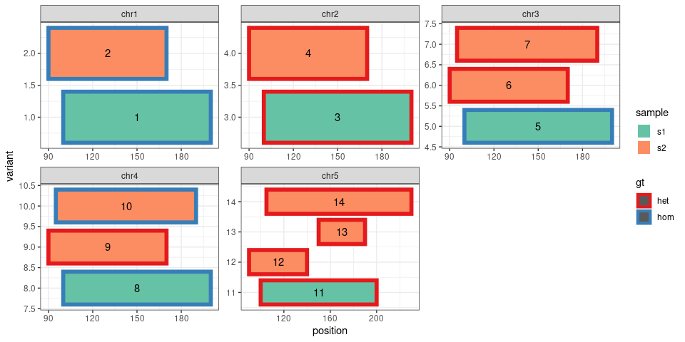
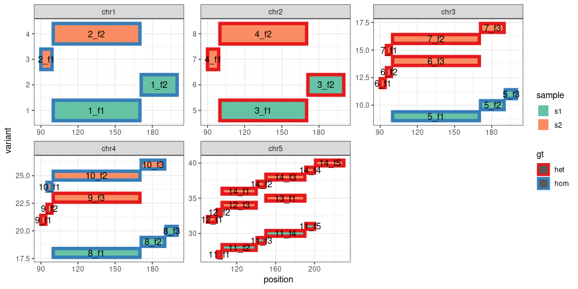
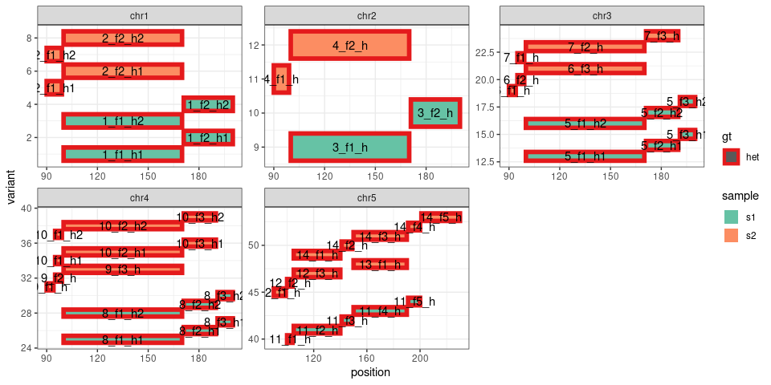
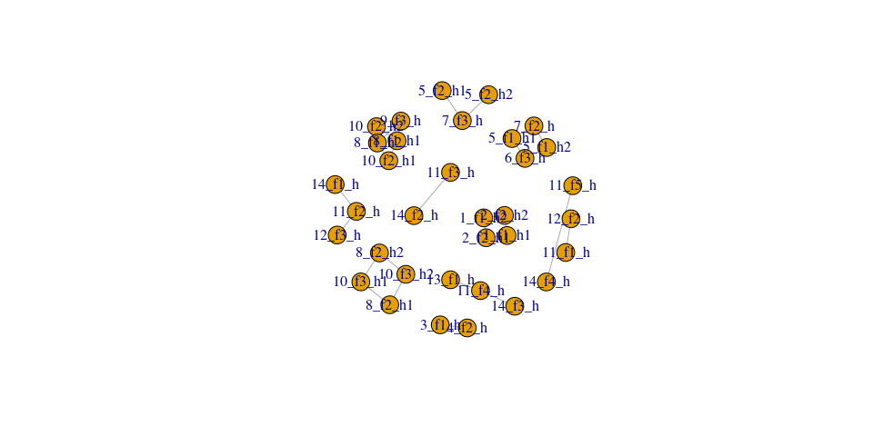
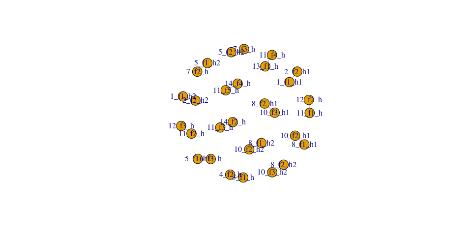

``` r
library(ggplot2)
library(dplyr)
library(RColorBrewer)
library(GenomicRanges)
library(igraph)
```

*Disclaimer: old quick-and-dirty tests for an experimental approach to
match genotypes. Never implement but might be interesting to revisit.
The basic idea was to use bipartite clustering to match single-copy
subregions. Homozygous variants are split into two single-copy variants
to handle cases where on hom must be matched with two hets. Regions are
split in smaller fragment, guided by the overlap, in order to handle
fragmentation, i.e. cases where, for example, two smaller variants
should be matched to one larger variant.*

# Unit tests for deletions

``` r
bed = read.table("../tests/delgenotype.bed", as.is = TRUE, sep = "\t")
colnames(bed) = c("chr", "start", "end", "sample", "gt", "error")
bed$id = 1:nrow(bed)
bed$gt = factor(bed$gt, levels = c("het", "hom"))
bed$w = 1

gt.pal = brewer.pal(3, "Set1")[1:2]
names(gt.pal) = c("het", "hom")
bed$idn = as.numeric(factor(bed$id))

bed = bed %>%
    ungroup %>%
    arrange(chr, sample) %>%
    mutate(idn = 1:n())
ggplot(bed) + geom_rect(aes(xmin = start, xmax = end, ymin = idn - 0.4, ymax = idn +
    0.4, fill = sample, color = gt), size = 2) + geom_text(aes(x = (start + end)/2,
    y = idn, label = id)) + theme_bw() + xlab("position") + ylab("variant") + scale_color_manual(values = gt.pal) +
    scale_fill_brewer(palette = "Set2") + facet_wrap(~chr, scale = "free")
```

<!-- -->

## Split into fragments

Optional because it makes sense mostly for deletions. Not sure how to
deal with insertions.

``` r
gr = makeGRangesFromDataFrame(bed)
gr.dj = disjoin(gr)
ol.df = findOverlaps(gr, gr.dj) %>%
    as.data.frame %>%
    mutate(w = width(gr[queryHits])/width(gr.dj[subjectHits]), w = 1/w)
bed.fs = bed[ol.df$queryHits, ]
bed.fs$start = start(gr.dj[ol.df$subjectHits])
bed.fs$end = end(gr.dj[ol.df$subjectHits])
bed.fs$w = ol.df$w
bed.fs = bed.fs %>%
    group_by(id) %>%
    mutate(id2 = paste0(id, "_f", 1:n())) %>%
    ungroup %>%
    mutate(id = id2)

bed.fs = bed.fs %>%
    ungroup %>%
    arrange(chr, sample) %>%
    mutate(idn = 1:n())
ggplot(bed.fs) + geom_rect(aes(xmin = start, xmax = end, ymin = idn - 0.4, ymax = idn +
    0.4, fill = sample, color = gt), size = 2) + geom_text(aes(x = (start + end)/2,
    y = idn, label = id)) + theme_bw() + xlab("position") + ylab("variant") + scale_color_manual(values = gt.pal) +
    scale_fill_brewer(palette = "Set2") + facet_wrap(~chr, scale = "free")
```

<!-- -->

## Split homogeneous variants

``` r
homs = bed.fs %>%
    filter(gt == "hom")
homs = rbind(homs, homs) %>%
    group_by(chr, start, end, sample) %>%
    mutate(gt = "het", id = paste0(id, "_h", 1:n()), w = w * 2) %>%
    as.data.frame
bed.hs = bed.fs %>%
    filter(gt == "het") %>%
    mutate(id = paste0(id, "_h")) %>%
    rbind(homs)

bed.hs = bed.hs %>%
    ungroup %>%
    arrange(chr, sample) %>%
    mutate(idn = 1:n())
ggplot(bed.hs) + geom_rect(aes(xmin = start, xmax = end, ymin = idn - 0.4, ymax = idn +
    0.4, fill = sample, color = gt), size = 2) + geom_text(aes(x = (start + end)/2,
    y = idn, label = id)) + theme_bw() + xlab("position") + ylab("variant") + scale_color_manual(values = gt.pal) +
    scale_fill_brewer(palette = "Set2") + facet_wrap(~chr, scale = "free")
```

<!-- -->

## Overlap

``` r
s1 = bed.hs %>%
    filter(sample == "s1") %>%
    makeGRangesFromDataFrame(keep.extra.columns = TRUE)
s2 = bed.hs %>%
    filter(sample == "s2") %>%
    makeGRangesFromDataFrame(keep.extra.columns = TRUE)
ol.df = findOverlaps(s1, s2) %>%
    as.data.frame %>%
    mutate(id1 = s1$id[queryHits], id2 = s2$id[subjectHits], w = s1$w[queryHits] *
        s2$w[subjectHits])
gg = ol.df %>%
    select(id1, id2) %>%
    as.matrix %>%
    t %>%
    as.vector %>%
    as.character %>%
    make_graph(directed = FALSE)
edge_attr(gg)$weight = ol.df$w
types = c(rep(FALSE, length(s1)), rep(TRUE, length(s2$id)))
names(types) = c(s1$id, s2$id)
vertex_attr(gg)$type = types[vertex_attr(gg)$name]
## plot(gg, layout = layout_as_bipartite)
plot(gg)
```

<!-- -->

``` r
bpm = max_bipartite_match(gg)$matching
bpm = bpm[which(!is.na(bpm))]
gg.bp = rbind(names(bpm), bpm) %>%
    as.character %>%
    make_graph(directed = FALSE) %>%
    simplify
vertex_attr(gg.bp)$type = types[vertex_attr(gg.bp)$name]
plot(gg.bp)
```

<!-- -->
